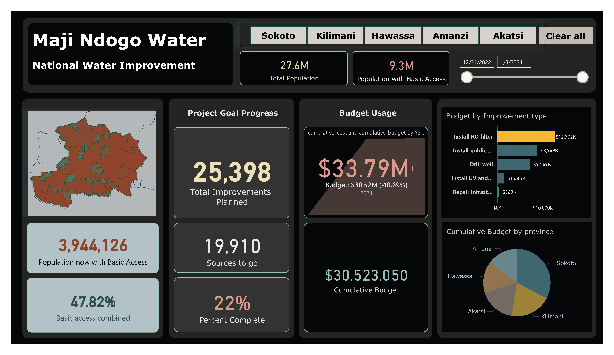
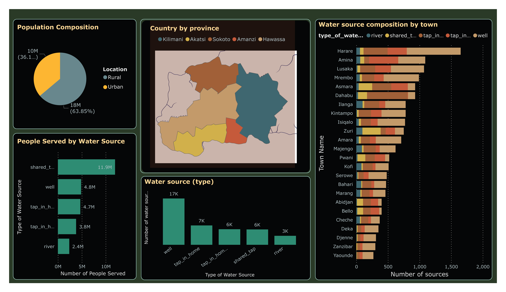
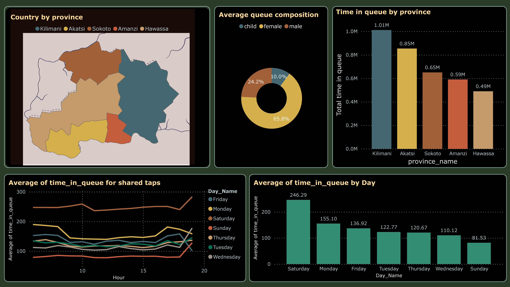
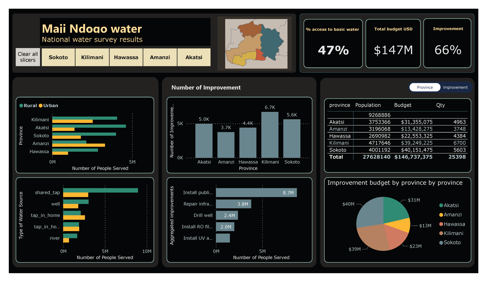
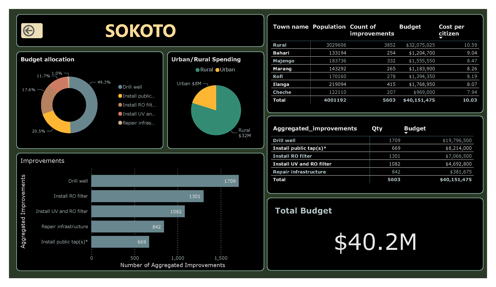
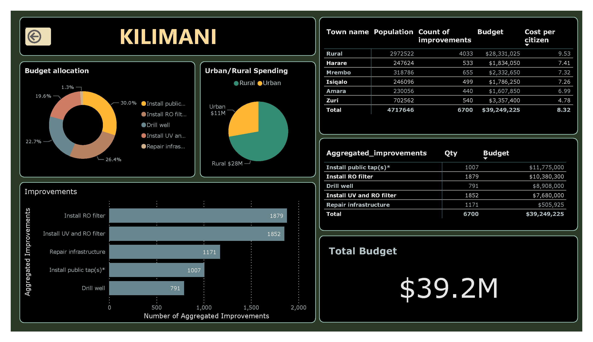
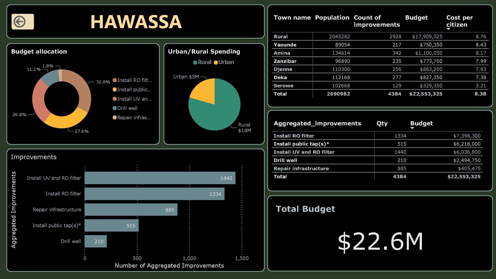
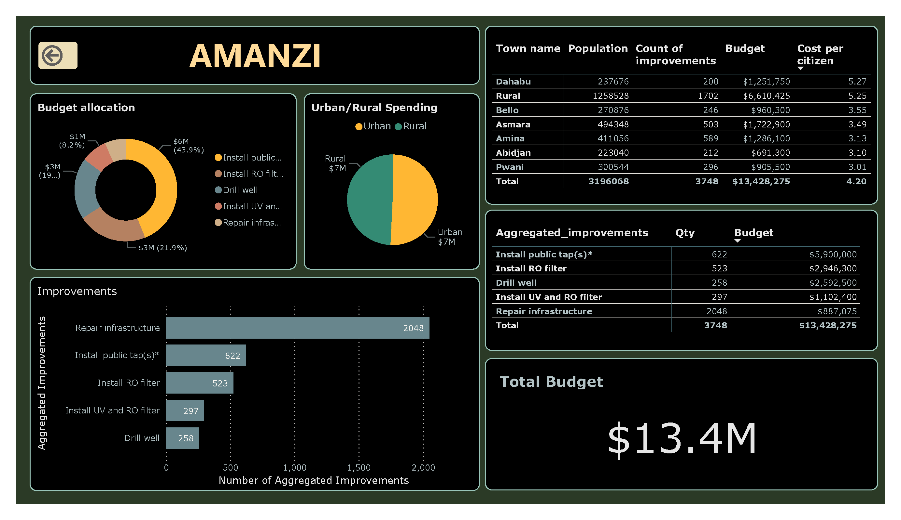
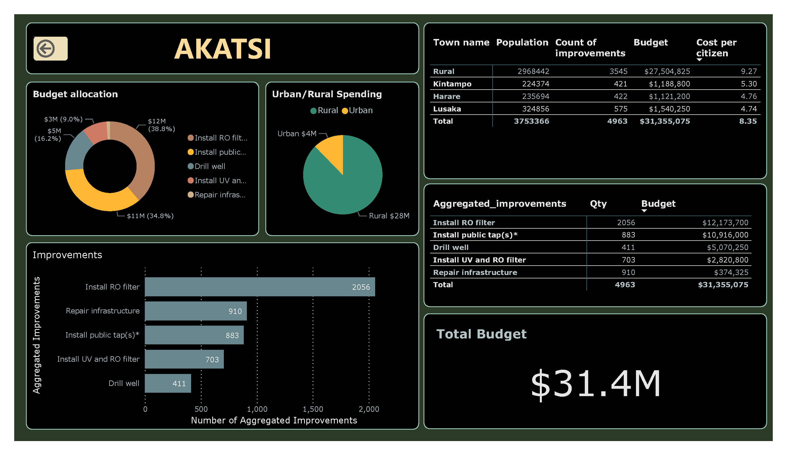

# Maji Ndogo Water Improvement Project
*From scarcity to sustainability: a data‑driven journey in Power BI*

## Table of Contents
- Overview
- [Proposed Solutions & Budget](#rogress After One Year
- Final Outcomes & Vendor Analysis
- Next Steps & Key Takeaways
- Tools Used
- How to Explore
- Contact

---

## Overview
Maji Ndogo began with severe water access gaps: only **~33.6%** (~9.3M of 27.6M people) had basic access, while millions relied on queues, shared taps, or unsafe sources. This project uses **Power BI** to reveal where needs are greatest, quantify trade‑offs (cost per citizen, quality, queues), and guide interventions to universal access.

**Snapshot of the maji ndogo overview**  

### Water Source Utilization
Rural communities host roughly **two‑thirds** of the population yet suffer the widest access deficits due to distance, infrastructure age, and sparse service coverage. Prioritizing **rural wells and communal taps** directly reduces travel time, flattens queues, and creates the fastest equity gains.  

Usage concentrates in **wells (~46%)** and **shared taps (~18%)**, while **broken tap‑in‑home** connections affect **~21% (~5M people)**—a latent capacity that can be restored quickly. Repairing household taps provides immediate wins, while medium‑term investments expand well capacity and public taps to meet demand.  

**Snapshot of water source**  

### Queue Burdens
Queues peak **4–6 PM** and on **Saturdays** (avg **~246 mins**; vs **~82 mins** on Sundays), reflecting after‑work collection and weekend household loads. **Women ~66%**, **men 24%**, and **children 10%** dominate queue composition; **Kilimani** bears the heaviest regional burden (≈**702 days** cumulative wait) vs **Hawassa** (~**340 days**).  

**Snapshot of queue time and composition**  

### Gender, Safety & Crime
Men comprise **~64.39%** of total victims (~49.7K), driven by theft and public‑intoxication incidents, while women face **disproportionate harassment (~60%)** and **sexual assault (~80%)**, especially during water collection. Crime peaks **8–10 PM**, with **Kilimani** (~20K crimes) as a hotspot; Mondays and Fridays trend higher, warranting targeted patrols, lighting, and safe‑queue design.  

**Snapshot of gender disparity and crime**  

---

## Proposed Solutions & Budget
The national plan invests **$147M** across five interventions—**drill wells**, **install public taps**, **install RO**, **install UV+RO**, and **repair infrastructure**—to progress rapidly toward universal access. KPIs track **population served**, **improvements completed**, **cost per citizen**, and **province‑level progress**.  

  **snapshot of national plan and budget**  

**Allocation by Province**
Budgets reflect both **need and feasibility** across **Sokoto, Kilimani, Hawassa, Amanzi, Akatsi**, with rural‑heavy provinces receiving proportionally larger allocations. Drill‑through dashboards trace every dollar from national totals down to town‑level actions, enabling transparent decision‑making.  

**Improvement Types & Cost per Citizen**
Spending balances **fast wins** (repairs, public taps) with **safety upgrades** (RO/UV) and **capacity** (wells). Final allocation totals show **public taps ~$43.0M**, **RO ~$40.0M**, **wells ~$38.9M**, **UV+RO ~$22.3M**, **repairs ~$2.55M**—with cost‑per‑citizen guiding efficient placement.  

### Province Drill‑through
Each province has a dedicated dashboard page with budgets, improvements, urban/rural split, town‑level detail, and cost per citizen.

#### Sokoto
Strategy blends **well drilling** and **public taps** to serve dispersed rural towns, with RO at contaminated points. Planned **5,603 improvements** and **$40.15M** budget (cost per citizen **~6.95**) target high‑need communities.  

**Snapshot of Sokoto plan and budget**  

#### Kilimani 
Emphasis on **public taps** and **RO** addresses dense demand, queue pressure, and contamination near urban hubs. Planned **6,700 improvements** and **$39.25M** budget (cost per citizen **~5.96**) prioritize high‑crime neighborhoods for safer access.  

**Snapshot of Kilimani plan and budget**  
 

#### Hawassa
Follows A balanced approach of **RO/UV** and **public taps** stabilizes quality while expanding access. Planned **4,384 improvements**, **$22.55M** budget, and cost per citizen **~5.87** are managed via corridor‑based clustering.  

**Snapshot of Hawassa plan and budget**  

#### Amanzi
**Repairs** and **public taps** quickly restore dormant household capacity, followed by **RO** to secure water quality. Planned **3,748 improvements**, **$13.43M** budget, and cost per citizen **~4.20** improve parity across urban and rural blocks.  

**Snapshot of Amanzi plan and budget**  

#### Akatsi 
Leaning into **RO** and **public taps** with strategic **well drilling** extends rural reach at a competitive cost per citizen (**~5.23**). Planned **4,963 improvements** and **$31.36M** budget to reduce boil‑water advisories and expand safe coverage.  

**Snapshot of Akatsi plan and budget**  

---

## Progress After One Year
After one year, basic access rose from **~33.6%** to **~48%**, benefiting **~3.94M** additional people. The program achieved **~22% completion** (≈**5,459** of **25,398** improvements), signaling a strong start while revealing areas to optimize.  
**Dashboard**  
![ear 1 – Progress

### Budget vs Actual
Actual spend reached **$33.79M** versus a **$30.52M** budget (**‑10.69% variance**), reflecting accelerated delivery in high‑need zones and front‑loaded RO deployments. Variance drivers include rural logistics and vendor travel patterns that central planning can mitigate.  
**Dashboard**  
![Year 1 – Budgetvs Actual

### Vendor Performance (Year 1)
Top vendors combined **throughput** with **cost discipline** across improvement types (RO, UV+RO, taps, wells, repairs). Early standouts set benchmarks for assignment in Year 2, informing a more geography‑aware routing to reduce variance.  
**Dashboards**  
!Year 1 – Vendor Leaderboard  

---

## Final Outcomes & Vendor Analysis
The project completed **all 25,398 improvements** and achieved **100% basic access**, adding **~18.36M** people to reliable, safe water. Queue times and contamination alerts fell as taps, wells, and RO/UV systems went live in priority clusters.  
**Dashboard**  
!Final – Completion & Access

### Vendors & Operational Insights
**Entebbe RO Installers** delivered cost‑effective RO throughput by minimizing travel and maximizing completion density. In contrast, teams like **MBS605 (Sokoto)** operated in harsh rural conditions where higher costs align with context; a capability‑ and geography‑aware assignment model will reduce travel, variance, and lead times across all vendors.  
**Dashboard**  
!Final – Vendor Performance

---

## Next Steps & Key Takeaways

### Next Steps
**Rural Infrastructure Development.** Concentrate wells and communal taps in underserved rural regions to close the urban–rural gap and cut travel time to water; expect measurable queue and equity gains.  
**Crime Prevention Initiatives.** Run awareness campaigns during peak crime hours/days, coordinate lighting, patrols, and community watches near water points to keep vulnerable groups safe.  
**Optimize Vendor Selection & Assignments.** Match vendors to projects by strengths, geography, and cost‑effectiveness; encourage local jobs to reduce travel overhead and variance.  
**Centralized Project Planning.** Allocate work by proximity and capability, with real‑time updates to shrink downtime and logistics costs; early trials indicate improved on‑budget delivery.  
**Regional Cost Management.** Budget realistically for rural terrain (e.g., Sokoto/Kilimani), and evaluate vendors on efficiency and contextual performance—not price alone.  
**Team Collaboration.** Share best practices (e.g., Entebbe’s localized operations) via workshops to replicate success, reduce delays, and align costs with budgets.  
**Continuous Monitoring.** Track performance, costs, and vendor SLAs in dashboards; create feedback loops to refine strategies without compromising quality.

### Key Takeaways
**Water Infrastructure Insights.** Spatial mapping and demographics guide targeted projects; treemaps/bars clarify the role and distribution of each water source.  
**Crime Dynamics Analysis.** Gender‑aware visuals (pie, bars, timelines) pinpoint where and when to deploy safety measures and awareness campaigns.  
**Improvement Project Planning.** Donut/pie allocations and totals make scope and priorities transparent, enabling accountable, equitable spending.  
**Data‑Driven Governance.** The dashboard suite turns complex operations into actionable decisions, building trust and sustaining universal access.

---

## Tools Used
- **Power BI Desktop** — Data modeling, DAX, and interactive dashboards    
- **GitHub** — Documentation and versioning

---

## How to Explore
- Browse all **inline dashboards** above.  
- (Optional) Add a link to the **Power BI Service** or share a redacted **.pbix** for reproducibility.  
- Images live in: [`MD_water_dashboards/](https://github.com/surafellh/Maji-Ndogo-Visualization/tree/main/MD_water_dashboards).

---

## Contact
**Author:** Surafel  
**Location:** Addis Ababa, Ethiopia  
**LinkedIn/GitHub/Email:** _surafelhailu17@gmail.com_
